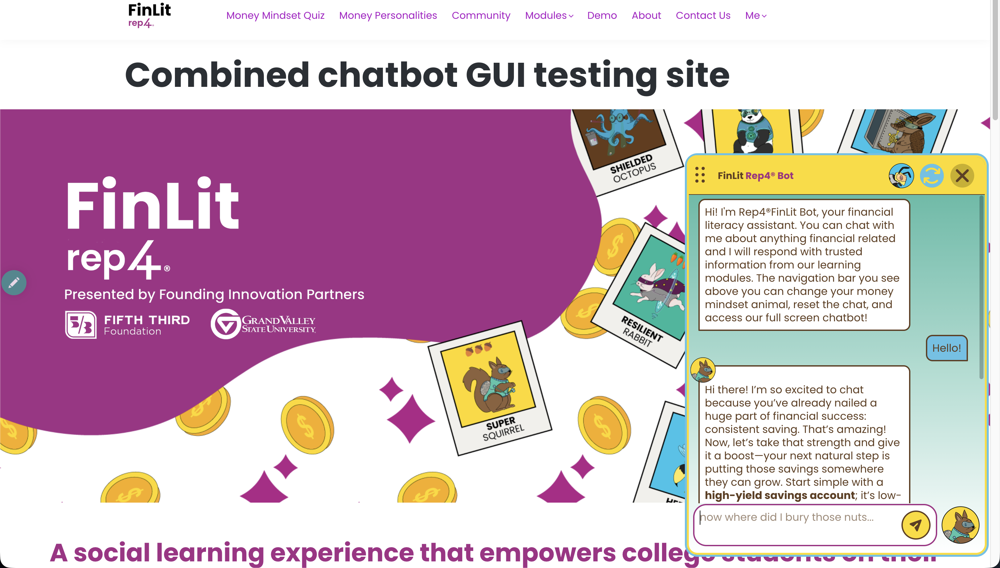
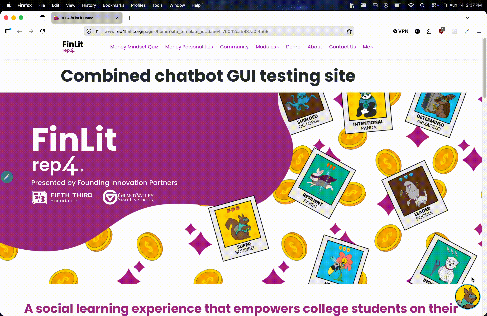
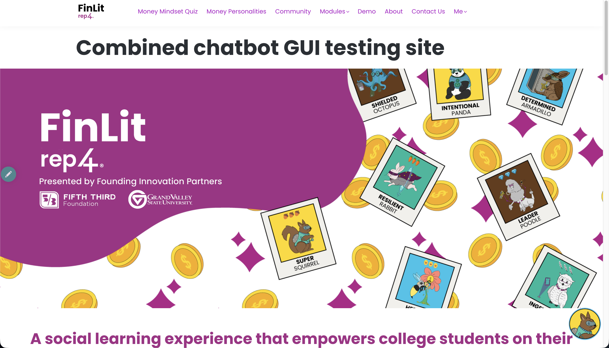
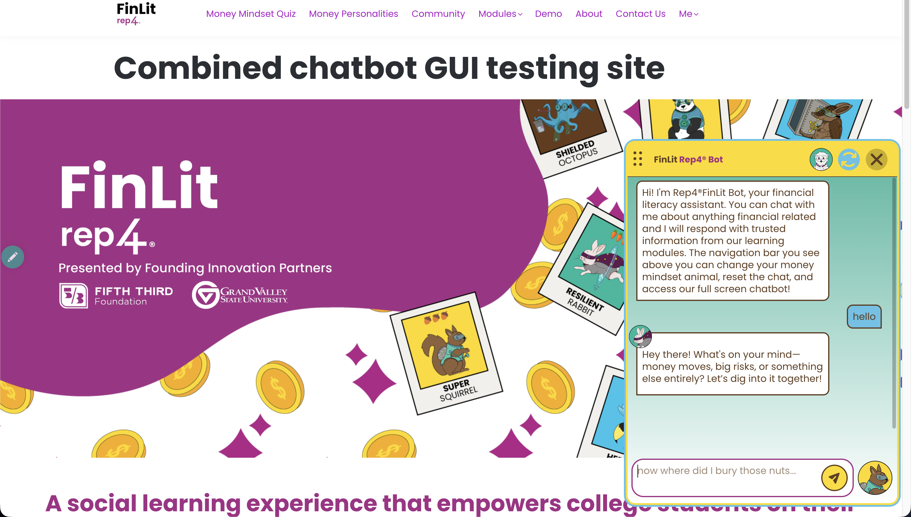
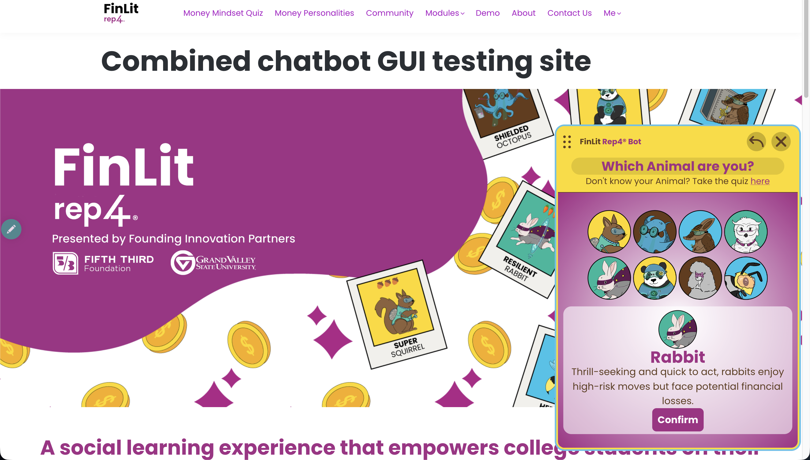
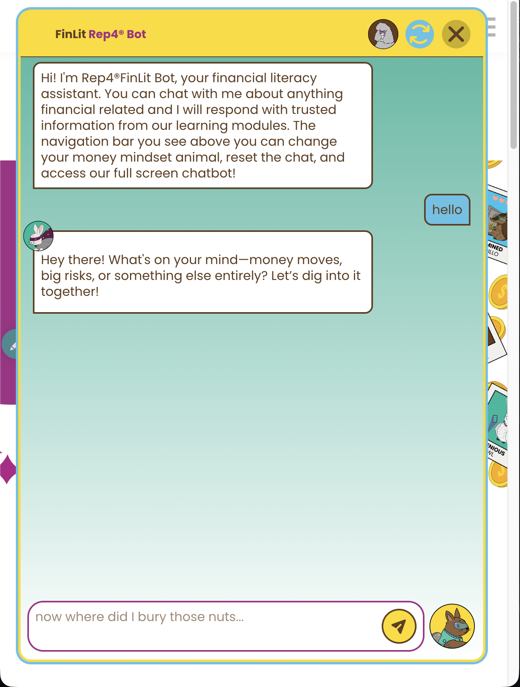

# Rep4FinLit Frontend Chatbot



## Overview

&emsp;The following repository is the frontend code for the **Rep4FinLit** chatbot. The frontend is designed to run on LearnWorlds hence why all code is contained in a single `index.html`. Caleb and Diego are the primary developers of this repo so feel free to ask either of us questions, and if we no longer work for rep4FinLit... **Good Luck**

## Quick Start

To work on this project there are **two** methods:

1. **Locally (Recomended):** `git clone` the repo and work with the code on your computer utilizing hosting it locally to view it or just put the file path to `index.html` into your browser. To update the code that is present on Learn Worlds copy all code inside of the `<body>` tag then refer to method 2 for where to paste the code.

2. **On Learn Worlds:** inside the Learn Worlds editor under `Website` (need to be signed in as a staff member) -> `Design` -> find and click `combined chatbot GUI testing` -> at the top `Site` -> `Site custom code` -> `<body> logged in (html)` then simply scroll until you find the chatbot code. to view the code you can hit `preview`.\
   &emsp;If you want to edit the **live** version of going to `combined chatbot GUI testing` go to `REP4ⓇFinLit site`. **WARNING** whatever you do on the live site will be live so make sure your update of code has few to no bugs

Local editing is recomended because you can use `git` for a clear history of the code and avoid risk of losing your progress that editing in Learn Worlds has.

## Visual Look at the GUI

**Usage GIF**


**Closed State**


**Open Chat**


**Animal Selection**


**Mobile Mode (fullscreens chatbot)**


## Features

- Animal selection - allows user to change their money mindset personality
- Token streamed LLM response formatted using markdown to innerHTML convertor
- Reset chat which deletes all messages
- Resize to any desired size and ratio
- Hides during self-assessments in modules so users cannot cheat
- mobile responsive

## Code Organization

```
HTML (structure only)
├── Imports
├── Unopened icon
├── Chat container
│   ├── Animal choice
│   ├── Pop-up screens
│   └── Chat content
│       ├── Top bar
│       ├── Messages
│       └── Input
│
CSS (main <style>)
├── Defaults/variables
├── Unopened chatbot
├── Opened chatbot
└── Pop-up screens
│
JavaScript (main <script>)
├── Variables/data
├── Core functions
└── API/streaming
│
Responsive CSS (second <style>)
└── Mobile media queries
│
Responsive JS (second <script>)
└── mobileChanges()
```

## Common Things you may need to Change

Change animal **images/descriptions** => `animalDict`, `Descriptions`\
Change default **colors** => `:root`\
Change **placeholder text** per animal => `animalPlaceholder`\
Toggle **mock/dummy** message for testing => comment `runFetch()` line and uncomment mock response (line right below `runFetch`)

## Backend

This doesn not explain how the backend works only highlights important things to know about the backend for frontend development

- - Backend will **NOT WORK** when locally hosted because the backend verifies it is receiving a request from rep4FinLit.org (This is why the mock/dummy message is convenient for development)
- The Backend is hosted on Azure through specifically the `/chat/stream` endpoint.
- Expects the following values when making a request `{ message, session_id, avatar }`
- Backend sends `markdown` formatted response then `marked.min.js` converts markdown into html format (this is because html cannot render markdown but can render "innerHTML")
